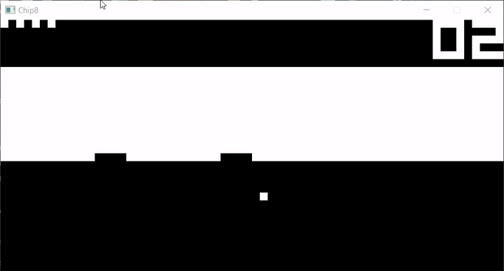
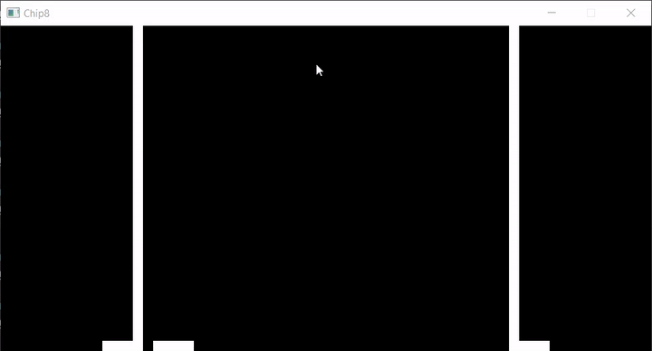
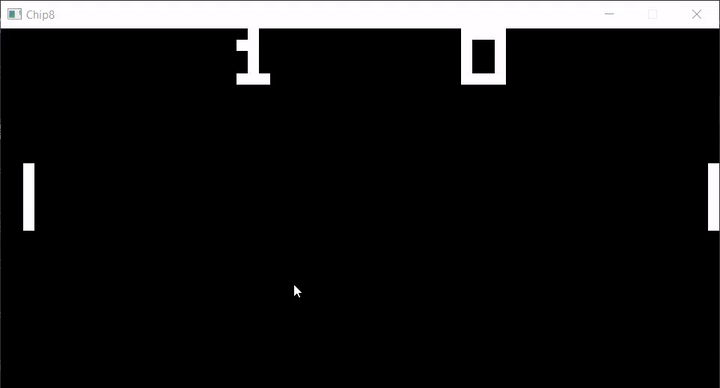
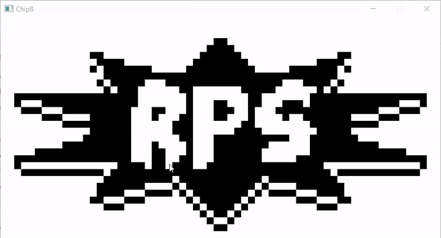
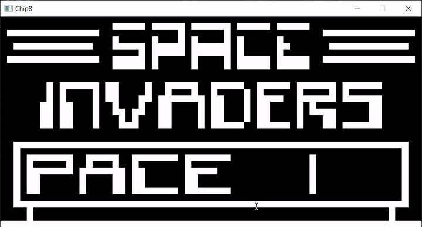
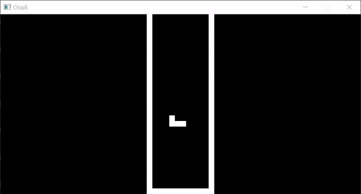

# CHIP8 Emulator

My first attempt at emulation. This Go project aims to emulate a fully working CHIP8 system complete with graphics, a working CPU, memory, sound, and keyboard input.

Everything works as far as I have tested, except for audio.

## Usage
```
Usage: chip8 [--scaling SCALING] [--fps FPS] [--cpuspeed CPUSPEED] ROMPATH

Positional arguments:
  ROMPATH                Path to CHIP8 ROM file.

Options:
  --scaling SCALING, -s SCALING
                         Pixel scaling. Adjusts size of display. [default: 15]
  --fps FPS, -f FPS      FPS to run display at. [default: 60]
  --cpuspeed CPUSPEED, -c CPUSPEED
                         Speed of CPU relative to FPS. [default: 10]
  --help, -h             display this help and exit
  --version              display version and exit
```

## Controls
 Keys

 ---
 
 <table cellspacing="0" cellpadding="3" border="1">
			<tbody><tr><td><tt>1</tt></td><td><tt>2</tt></td><td><tt>3</tt></td><td><tt>4</tt></td></tr>
			<tr><td><tt>Q</tt></td><td><tt>W</tt></td><td><tt>E</tt></td><td><tt>R</tt></td></tr>
			<tr><td><tt>A</tt></td><td><tt>S</tt></td><td><tt>D</tt></td><td><tt>F</tt></td></tr>
			<tr><td><tt>Z</tt></td><td><tt>X</tt></td><td><tt>C</tt></td><td><tt>V</tt></td></tr>
</tbody></table>

 map to

 <table cellspacing="0" cellpadding="3" border="1">
			<tbody><tr><td><tt>1</tt></td><td><tt>2</tt></td><td><tt>3</tt></td><td><tt>C</tt></td></tr>
			<tr><td><tt>4</tt></td><td><tt>5</tt></td><td><tt>6</tt></td><td><tt>D</tt></td></tr>
			<tr><td><tt>7</tt></td><td><tt>8</tt></td><td><tt>9</tt></td><td><tt>E</tt></td></tr>
			<tr><td><tt>A</tt></td><td><tt>0</tt></td><td><tt>B</tt></td><td><tt>F</tt></td></tr>
</tbody></table>

respectively

---

## Screenshots


| Brick                             | Connect 4                     | Pong                   |
|-----------------------------------|-------------------------------|------------------------|
|              |       |    |

| Rock Paper Scissors               | Space Invaders                | Tetris                 |
|-----------------------------------|-------------------------------|------------------------|
|  |  |  |


## TODO (in no particular order):
- Add more invasive features (e.g. Soft reset, Hard reset, memory manipulation, etc.)
- Implement VIP/Super chip8
- Implement audio (needs a better understanding of goroutines and channels)

## Credits

- Thanks to CowGod a.k.a. [Thomas P. Greene](mailto:cowgod@rockpile.com) for their extremely helpful chip8 documentation!

    [Link to Docs](http://devernay.free.fr/hacks/chip8/C8TECH10.HTM)

- Thanks to [@Skosulor](https://github.com/Skosulor) for their chip8 [testing ROM](./ROMs/TEST1.ch8) that helped me identify a mistake in the chip8 docs.

    [Link to Testing ROM](https://github.com/Skosulor/c8int/tree/master/test)


- Thanks to [@corax](https://github.com/corax89) for their chip8 [testing ROM](./ROMs/TEST.ch8) that helped me identify an error in my stack and instruction pointer.

    [Link to Testing ROM](https://github.com/corax89/chip8-test-rom)

- Thanks to [@kripod](https://github.com/kripod) for his collection of chip8 ROMs. Most of the non-testing ROMs are from here.

    [Link to Collection](https://github.com/kripod/chip8-roms)
